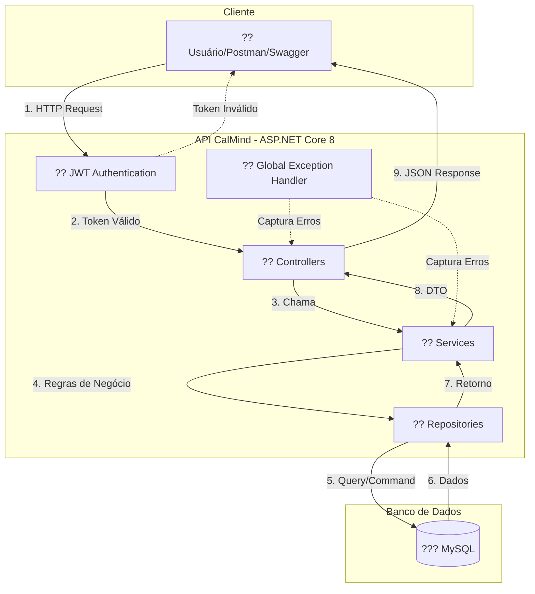
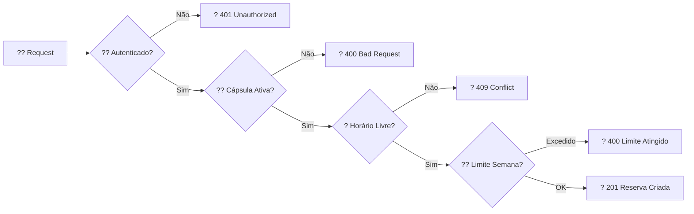
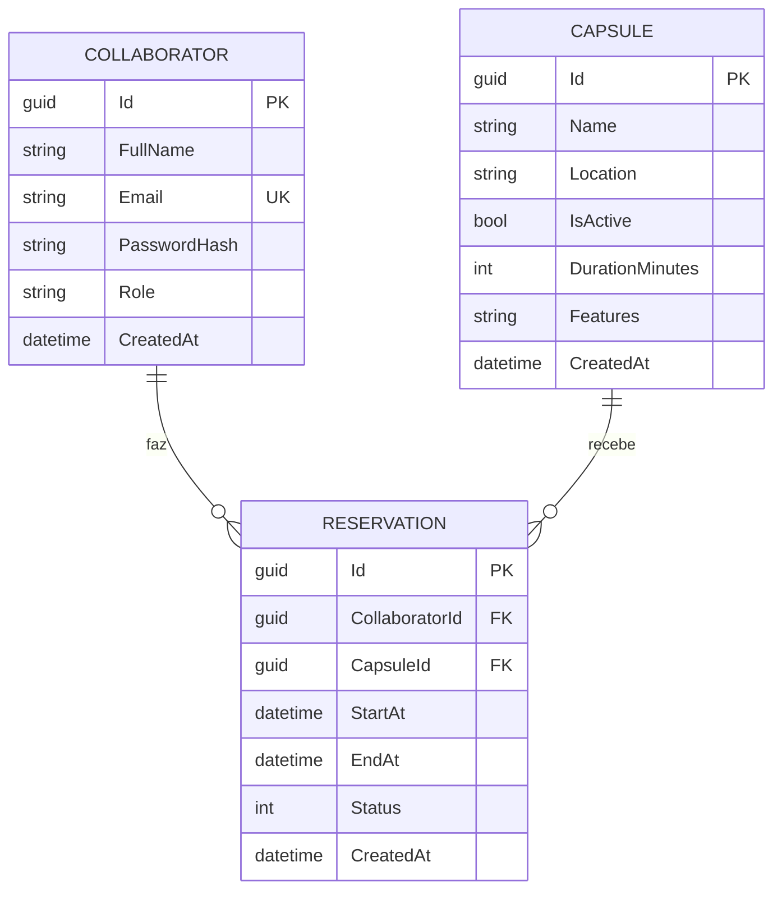

# ?? CalMind API - Sistema de Reserva de Cápsulas de Relaxamento

## ?? Integrantes

| Nome | RM |
|------|-----|
| Irana Pereira | 98593 |
| Lucas Vinicius | 98480 |
| Mariana Melo | 98121 |

---

## ?? Sobre o Projeto

**CalMind** é uma API RESTful desenvolvida em ASP.NET Core 8.0 para gerenciar reservas de cápsulas de relaxamento em ambientes corporativos, promovendo o bem-estar e a saúde mental no futuro do trabalho.

### ?? Tema: O Futuro do Trabalho

Com o aumento do estresse e burnout no ambiente corporativo, o CalMind propõe uma solução tecnológica para facilitar o acesso a espaços de relaxamento, contribuindo para a saúde mental e produtividade dos colaboradores.

---

## ?? Funcionalidades

### ?? Autenticação e Segurança
- ? Registro de usuários (Admin e User)
- ? Login com geração de Token JWT
- ? Autenticação Stateless
- ? Autorização baseada em perfis (Roles)
- ? Hash de senhas com BCrypt

### ?? Gerenciamento de Cápsulas
- ? Cadastro de cápsulas (apenas Admin)
- ? Consulta de cápsulas por ID
- ? Configuração de duração por cápsula

### ?? Sistema de Reservas
- ? Criação de reservas com validação de conflitos
- ? Limite de 2 reservas por colaborador/semana
- ? Consulta de horários disponíveis
- ? Cancelamento de reservas
- ? Listagem de reservas por colaborador

---

## ??? Tecnologias Utilizadas

| Tecnologia | Versão | Descrição |
|------------|--------|-----------|
| ASP.NET Core | 8.0 | Framework Web API |
| Entity Framework Core | 8.0.10 | ORM para acesso a dados |
| MySQL | 8.0+ | Banco de dados relacional |
| Pomelo.EntityFrameworkCore.MySql | 8.0.2 | Provider MySQL |
| JWT Bearer | 8.0.10 | Autenticação |
| BCrypt.Net-Next | 4.0.3 | Criptografia de senhas |
| Swagger/OpenAPI | 6.6.2 | Documentação da API |

---

## ?? Estrutura do Projeto

```
Calmind.Api/
??? Controllers/          # Endpoints da API
?   ??? AuthController.cs
?   ??? CapsuleController.cs
?   ??? CollaboratorController.cs
?   ??? ReservationController.cs
??? Services/             # Lógica de negócio
?   ??? Interfaces/
?   ??? AuthService.cs
?   ??? JwtService.cs
?   ??? CapsuleService.cs
?   ??? CollaboratorService.cs
?   ??? ReservationService.cs
??? Repositories/         # Acesso a dados
?   ??? Interfaces/
?   ??? Implementações...
??? Models/               # Entidades do domínio
?   ??? Collaborator.cs
?   ??? Capsule.cs
?   ??? Reservation.cs
??? DTOs/                 # Data Transfer Objects
??? Data/                 # Contexto do EF Core
??? Middleware/           # Tratamento de exceções
??? Migrations/           # Migrações do banco
```

---

## ?? Fluxo de Dados

### Arquitetura da Aplicação



### Fluxo de Criação de Reserva



### Modelo de Dados



---

## ?? Como Executar

### Pré-requisitos

- .NET 8.0 SDK
- MySQL Server 8.0+
- Visual Studio 2022 ou VS Code

### Passo a Passo

**1. Clone o repositório:**
```bash
git clone https://github.com/LucasVinicius45/calmind-api.git
cd Calmind.Api
```

**2. Configure a connection string em `appsettings.json`:**
```json
{
  "ConnectionStrings": {
    "DefaultConnection": "Server=localhost;Port=3306;Database=calmind_db;User=root;Password=SUA_SENHA;"
  },
  "Jwt": {
    "SecretKey": "CalmindSecretKey2025GlobalSolutionFIAP!@#$%",
    "Issuer": "CalmindAPI",
    "Audience": "CalmindClient",
    "ExpirationMinutes": "60"
  }
}
```

**3. Execute as migrations:**
```bash
dotnet ef database update
```

**4. Execute o projeto:**
```bash
dotnet run
```

**5. Acesse o Swagger:**
```
https://localhost:7186/swagger
```

---

## ?? Endpoints da API (v1)

### ?? Autenticação (`/api/v1/Auth`)

| Método | Endpoint | Descrição | Auth |
|--------|----------|-----------|------|
| POST | `/register` | Registrar usuário | ? |
| POST | `/login` | Fazer login | ? |

### ?? Cápsulas (`/api/v1/Capsule`)

| Método | Endpoint | Descrição | Auth |
|--------|----------|-----------|------|
| POST | `/` | Criar cápsula | ?? Admin |
| GET | `/{id}` | Buscar por ID | ?? User/Admin |

### ?? Reservas (`/api/v1/Reservation`)

| Método | Endpoint | Descrição | Auth |
|--------|----------|-----------|------|
| POST | `/` | Criar reserva | ?? User/Admin |
| GET | `/{id}` | Buscar por ID | ?? User/Admin |
| GET | `/collaborator/{id}` | Listar por colaborador | ?? User/Admin |
| GET | `/availability/{capsuleId}` | Verificar disponibilidade | ?? User/Admin |
| DELETE | `/{id}` | Cancelar reserva | ?? User/Admin |

### ?? Colaboradores (`/api/v1/Collaborator`)

| Método | Endpoint | Descrição | Auth |
|--------|----------|-----------|------|
| GET | `/{id}` | Buscar por ID | ?? Admin |
| GET | `/by-email/{email}` | Buscar por email | ?? Admin |

---

## ?? Regras de Negócio

| Regra | Descrição |
|-------|-----------|
| **Limite Semanal** | Máximo de 2 reservas por colaborador por semana (segunda a domingo) |
| **Conflito de Horário** | Não permite reservas sobrepostas na mesma cápsula |
| **Duração Automática** | EndAt = StartAt + DurationMinutes da cápsula |
| **Cápsulas Ativas** | Apenas cápsulas com `IsActive = true` aceitam reservas |
| **Autorização** | Admin: acesso total / User: apenas próprios dados |

---

## ?? Segurança Implementada

- ? **JWT Authentication** - Tokens com validade de 60 minutos
- ? **Autorização por Roles** - Admin e User com permissões diferentes
- ? **BCrypt** - Senhas armazenadas com hash seguro
- ? **Tratamento Global de Exceções** - Respostas padronizadas
- ? **Validação de Dados** - Data Annotations nos DTOs

---


## ?? Exemplos de Requisições

### Registrar Admin
```json
POST /api/v1/Auth/register
{
  "fullName": "Patricia Almeida",
  "email": "patricia.almeida@calmind.com",
  "password": "Admin@2025",
  "role": "Admin"
}
```

### Criar Cápsula
```json
POST /api/v1/Capsule
Authorization: Bearer {token}
{
  "name": "Cápsula Mindfulness",
  "location": "Andar 4 - Setor de Inovação",
  "isActive": true,
  "durationMinutes": 35,
  "features": "Cromoterapia, aromas cítricos"
}
```

### Criar Reserva
```json
POST /api/v1/Reservation
Authorization: Bearer {token}
{
  "collaboratorId": "guid-colaborador",
  "capsuleId": "guid-capsula",
  "startAtUtc": "2025-11-18T10:00:00Z"
}
```

---

## ?? Referências

- [ASP.NET Core Documentation](https://docs.microsoft.com/aspnet/core)
- [Entity Framework Core](https://docs.microsoft.com/ef/core)
- [JWT Authentication](https://jwt.io)
- [Pomelo MySQL Provider](https://github.com/PomeloFoundation/Pomelo.EntityFrameworkCore.MySql)

---

## ?? Licença

Projeto desenvolvido para a **Global Solution 2º Semestre** - FIAP  
Disciplina: **Software Development C# e Arquitetura Orientada A Serviços**